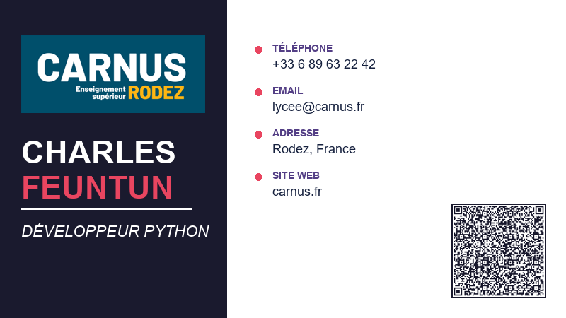
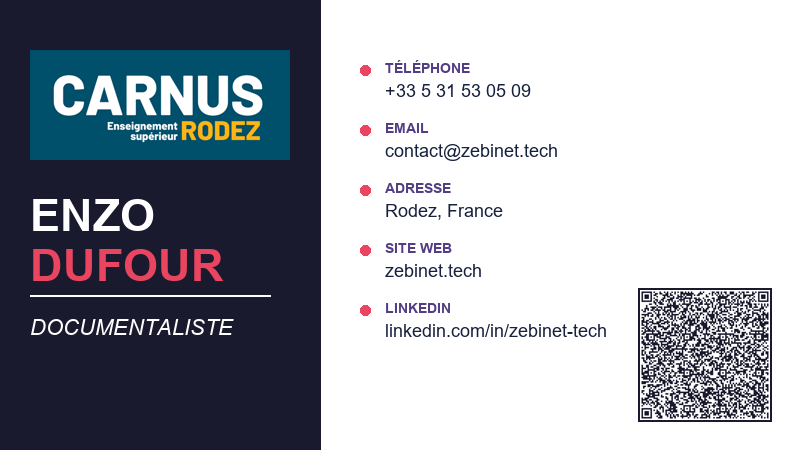
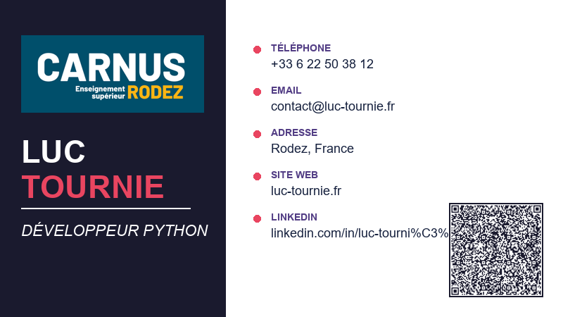
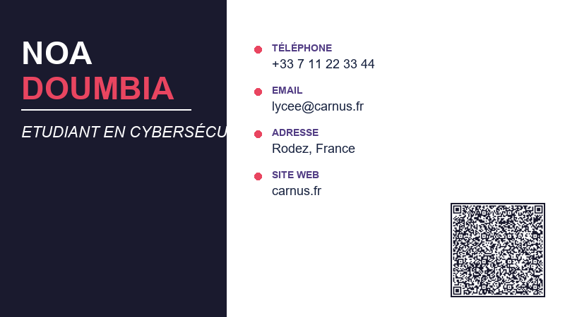

# TP-Gestion-Projet-1

**Développement Python avec GitHub Projects (Kanban & Roadmap)**

   ![vscode](https://img.shields.io/badge/VS%20Code-007ACC?style=for-the-badge&logo=data:image/svg+xml;base64,PHN2ZyB4bWxucz0iaHR0cDovL3d3dy53My5vcmcvMjAwMC9zdmciIHhtbG5zOnhsaW5rPSJodHRwOi8vd3d3LnczLm9yZy8xOTk5L3hsaW5rIiB2aWV3Qm94PSIwLDAsMjU2LDI1NiIgd2lkdGg9Ijk2cHgiIGhlaWdodD0iOTZweCIgZmlsbC1ydWxlPSJub256ZXJvIj48ZyBmaWxsPSIjZmZmZmZmIiBmaWxsLXJ1bGU9Im5vbnplcm8iIHN0cm9rZT0ibm9uZSIgc3Ryb2tlLXdpZHRoPSIxIiBzdHJva2UtbGluZWNhcD0iYnV0dCIgc3Ryb2tlLWxpbmVqb2luPSJtaXRlciIgc3Ryb2tlLW1pdGVybGltaXQ9IjEwIiBzdHJva2UtZGFzaGFycmF5PSIiIHN0cm9rZS1kYXNob2Zmc2V0PSIwIiBmb250LWZhbWlseT0ibm9uZSIgZm9udC13ZWlnaHQ9Im5vbmUiIGZvbnQtc2l6ZT0ibm9uZSIgdGV4dC1hbmNob3I9Im5vbmUiIHN0eWxlPSJtaXgtYmxlbmQtbW9kZTogbm9ybWFsIj48ZyB0cmFuc2Zvcm09InNjYWxlKDUuMzMzMzMsNS4zMzMzMykiPjxwYXRoIGQ9Ik00NCwxMS4xMXYyNS43OGMwLDEuMjcgLTAuNzksMi40IC0xLjk4LDIuODJsLTguODIsNC4xNGwwLjgsLTEwLjg1di0xOGwtMC44LC0xMC44NWw4LjgyLDQuMTRjMS4xOSwwLjQyIDEuOTgsMS41NSAxLjk4LDIuODJ6Ij48L3BhdGg+PHBhdGggZD0iTTksMzMuODk2bDI1LC0xOC44OTZ2LTkuNjQ3YzAsLTEuMTk4IC0xLjQ4MiwtMS43NTggLTIuMjc1LC0wLjg2bC0yNy4wNjcsMjQuNzQ2Yy0wLjksMC44MyAtMC44NDksMi4yNjcgMC4xMDcsMy4wMzJjMCwwIDEuMzI0LDEuMjMyIDEuODAzLDEuNTc0YzAuNzM2LDAuNTI1IDEuNzAzLDAuNTg1IDIuNDMyLDAuMDUxeiI+PC9wYXRoPjxwYXRoIGQ9Ik05LDE0LjEwNGwyNSwxOC44OTZ2OS42NDdjMCwxLjE5OCAtMS40ODIsMS43NTggLTIuMjc1LDAuODZsLTI3LjA2NywtMjQuNzQ2Yy0wLjksLTAuODMgLTAuODQ5LC0yLjI2NyAwLjEwNywtMy4wMzJjMCwwIDEuMzI0LC0xLjIzMiAxLjgwMywtMS41NzRjMC43MzYsLTAuNTI1IDEuNzAzLC0wLjU4NSAyLjQzMiwtMC4wNTF6Ij48L3BhdGg+PC9nPjwvZz48L3N2Zz4=&logoColor=white) ![windows](https://img.shields.io/badge/Windows-0078D4?style=for-the-badge&logo=data:image/svg+xml;base64,PHN2ZyB4bWxucz0iaHR0cDovL3d3dy53My5vcmcvMjAwMC9zdmciIHhtbG5zOnhsaW5rPSJodHRwOi8vd3d3LnczLm9yZy8xOTk5L3hsaW5rIiB2aWV3Qm94PSIwLDAsMjU2LDI1NiIgd2lkdGg9IjUwcHgiIGhlaWdodD0iNTBweCIgZmlsbC1ydWxlPSJub256ZXJvIj48ZyBmaWxsPSIjZmZmZmZmIiBmaWxsLXJ1bGU9Im5vbnplcm8iIHN0cm9rZT0ibm9uZSIgc3Ryb2tlLXdpZHRoPSIxIiBzdHJva2UtbGluZWNhcD0iYnV0dCIgc3Ryb2tlLWxpbmVqb2luPSJtaXRlciIgc3Ryb2tlLW1pdGVybGltaXQ9IjEwIiBzdHJva2UtZGFzaGFycmF5PSIiIHN0cm9rZS1kYXNob2Zmc2V0PSIwIiBmb250LWZhbWlseT0ibm9uZSIgZm9udC13ZWlnaHQ9Im5vbmUiIGZvbnQtc2l6ZT0ibm9uZSIgdGV4dC1hbmNob3I9Im5vbmUiIHN0eWxlPSJtaXgtYmxlbmQtbW9kZTogbm9ybWFsIj48ZyB0cmFuc2Zvcm09InNjYWxlKDUuMTIsNS4xMikiPjxwYXRoIGQ9Ik0xOS44NTIsNy43NjFsLTE1LDIuMjVjLTAuNDksMC4wNzQgLTAuODUyLDAuNDk0IC0wLjg1MiwwLjk4OXYxMmMwLDAuNTUzIDAuNDQ4LDEgMSwxaDE1YzAuNTUyLDAgMSwtMC40NDcgMSwtMXYtMTQuMjVjMCwtMC4yOTEgLTAuMTI3LC0wLjU2NyAtMC4zNDgsLTAuNzU4Yy0wLjIyLC0wLjE4OSAtMC41MTMsLTAuMjcxIC0wLjgsLTAuMjMxek00NS42NTIsNC4yNDJjLTAuMjIsLTAuMTg5IC0wLjUxMiwtMC4yNzEgLTAuODAxLC0wLjIzMWwtMjEsMy4xNWMtMC40ODksMC4wNzQgLTAuODUxLDAuNDk0IC0wLjg1MSwwLjk4OXYxNC44NWMwLDAuNTUzIDAuNDQ4LDEgMSwxaDIxYzAuNTUyLDAgMSwtMC40NDcgMSwtMXYtMThjMCwtMC4yOTEgLTAuMTI3LC0wLjU2NyAtMC4zNDgsLTAuNzU4ek0yMCwyNmgtMTVjLTAuNTUyLDAgLTEsMC40NDcgLTEsMXYxMmMwLDAuNDk1IDAuMzYyLDAuOTE1IDAuODUyLDAuOTg5bDE1LDIuMjVjMC4wNSwwLjAwNyAwLjA5OSwwLjAxMSAwLjE0OCwwLjAxMWMwLjIzOCwwIDAuNDcsLTAuMDg1IDAuNjUyLC0wLjI0MmMwLjIyMSwtMC4xOTEgMC4zNDgsLTAuNDY3IDAuMzQ4LC0wLjc1OHYtMTQuMjVjMCwtMC41NTMgLTAuNDQ4LC0xIC0xLC0xek00NSwyNmgtMjFjLTAuNTUyLDAgLTEsMC40NDcgLTEsMXYxNC44NWMwLDAuNDk1IDAuMzYyLDAuOTE1IDAuODUyLDAuOTg5bDIxLDMuMTVjMC4wNDksMC4wMDcgMC4wOTksMC4wMTEgMC4xNDgsMC4wMTFjMC4yMzgsMCAwLjQ3LC0wLjA4NSAwLjY1MiwtMC4yNDJjMC4yMjEsLTAuMTkxIDAuMzQ4LC0wLjQ2NyAwLjM0OCwtMC43NTh2LTE4YzAsLTAuNTUzIC0wLjQ0OCwtMSAtMSwtMXoiPjwvcGF0aD48L2c+PC9nPjwvc3ZnPg==&logoColor=white)    ![vscode](https://img.shields.io/badge/VS%20Code-007ACC?style=for-the-badge&logo=data:image/svg+xml;base64,PHN2ZyB4bWxucz0iaHR0cDovL3d3dy53My5vcmcvMjAwMC9zdmciIHhtbG5zOnhsaW5rPSJodHRwOi8vd3d3LnczLm9yZy8xOTk5L3hsaW5rIiB2aWV3Qm94PSIwLDAsMjU2LDI1NiIgd2lkdGg9Ijk2cHgiIGhlaWdodD0iOTZweCIgZmlsbC1ydWxlPSJub256ZXJvIj48ZyBmaWxsPSIjZmZmZmZmIiBmaWxsLXJ1bGU9Im5vbnplcm8iIHN0cm9rZT0ibm9uZSIgc3Ryb2tlLXdpZHRoPSIxIiBzdHJva2UtbGluZWNhcD0iYnV0dCIgc3Ryb2tlLWxpbmVqb2luPSJtaXRlciIgc3Ryb2tlLW1pdGVybGltaXQ9IjEwIiBzdHJva2UtZGFzaGFycmF5PSIiIHN0cm9rZS1kYXNob2Zmc2V0PSIwIiBmb250LWZhbWlseT0ibm9uZSIgZm9udC13ZWlnaHQ9Im5vbmUiIGZvbnQtc2l6ZT0ibm9uZSIgdGV4dC1hbmNob3I9Im5vbmUiIHN0eWxlPSJtaXgtYmxlbmQtbW9kZTogbm9ybWFsIj48ZyB0cmFuc2Zvcm09InNjYWxlKDUuMzMzMzMsNS4zMzMzMykiPjxwYXRoIGQ9Ik00NCwxMS4xMXYyNS43OGMwLDEuMjcgLTAuNzksMi40IC0xLjk4LDIuODJsLTguODIsNC4xNGwwLjgsLTEwLjg1di0xOGwtMC44LC0xMC44NWw4LjgyLDQuMTRjMS4xOSwwLjQyIDEuOTgsMS41NSAxLjk4LDIuODJ6Ij48L3BhdGg+PHBhdGggZD0iTTksMzMuODk2bDI1LC0xOC44OTZ2LTkuNjQ3YzAsLTEuMTk4IC0xLjQ4MiwtMS43NTggLTIuMjc1LC0wLjg2bC0yNy4wNjcsMjQuNzQ2Yy0wLjksMC44MyAtMC44NDksMi4yNjcgMC4xMDcsMy4wMzJjMCwwIDEuMzI0LDEuMjMyIDEuODAzLDEuNTc0YzAuNzM2LDAuNTI1IDEuNzAzLDAuNTg1IDIuNDMyLDAuMDUxeiI+PC9wYXRoPjxwYXRoIGQ9Ik05LDE0LjEwNGwyNSwxOC44OTZ2OS42NDdjMCwxLjE5OCAtMS40ODIsMS43NTggLTIuMjc1LDAuODZsLTI3LjA2NywtMjQuNzQ2Yy0wLjksLTAuODMgLTAuODQ5LC0yLjI2NyAwLjEwNywtMy4wMzJjMCwwIDEuMzI0LC0xLjIzMiAxLjgwMywtMS41NzRjMC43MzYsLTAuNTI1IDEuNzAzLC0wLjU4NSAyLjQzMiwtMC4wNTF6Ij48L3BhdGg+PC9nPjwvZz48L3N2Zz4=&logoColor=white) 

## Objectifs

* Structurer un **projet informatique collaboratif**
* Utiliser **GitHub Projects** pour planifier et suivre un projet
* Mettre en œuvre un **workflow Kanban** et une **Roadmap (Gantt)**
* Gérer des **issues**, des **milestones (sprints)** et des **labels**
* Relier **développement**, **tests** et **documentation**
* Produire un **livrable professionnel** (code + suivi de projet)

## Pré-requis

* Compte GitHub actif
* Notions de base sur :

  * repositories
  * issues
* Poste avec navigateur web
* Bases de Python

## Outils utilisés

* GitHub
* GitHub Projects (Kanban + Roadmap)
* Python
  *(IDLE, VS Code, Thonny ou Jupyter Notebook)*

## Mini-projet support

### Application Python : **Gestionnaire de contacts**

L’application permet de gérer une liste de contacts stockée dans un fichier (JSON ou CSV).

### Fonctionnalités attendues

| Issue                     | Description                         | Responsable | Sprint   | Début | Fin   |
| ------------------------- | ----------------------------------- | ----------- | -------- | ----- | ----- |
| Création fichier contacts | Stockage des contacts (JSON ou CSV) | Noa         | Sprint 1 | 15/01 | 17/01 |
| Ajouter un contact        | Ajout d’un contact                  | Charles     | Sprint 1 | 15/01 | 18/01 |
| Supprimer un contact      | Suppression d’un contact            | Charles     | Sprint 1 | 20/01 | 22/01 |
| Lister les contacts       | Affichage des contacts              | Luc         | Sprint 1 | 20/01 | 22/01 |
| Tests unitaires           | Vérification des fonctionnalités    | Enzo        | Sprint 2 | 25/01 | 27/01 |
| Documentation utilisateur | Procédure d’utilisation             | Luc         | Sprint 2 | 25/01 | 28/01 |

## Répartition des rôles

### 1. Chef de projet / Scrum Master - Doumbia Noa

* Création et gestion du **GitHub Project**
* Suivi du Kanban et de la Roadmap
* Reporting d’avancement

### 2. Développeur Python principal - Feuntun Charles

* Développement des fonctionnalités cœur
* Mise à jour des issues associées

### 3. Développeur Python secondaire / Testeur - Tournier Luc

* Fonctions complémentaires
* Tests unitaires simples

### 4. Documentaliste / Testeur - Dufour Enzo

* Fiches de test
* Fiche de recette
* Mini-manuel utilisateur

## 🛠️ Structure du test

| Élément | Utilisation prévue |
| :--- | :--- |
| **Issues** | Unités de travail atomiques (Bugs, Features, Tests). |
| **Labels** | Catégorisation par priorité (`prio:high`) et par type (`type:test`). |
| **Milestones** | Regroupement des issues par versions ou sprints. |
| **Project (V2)** | Vue Kanban pour le quotidien et vue Roadmap pour la planification. |

## Contact 

---

> [!IMPORTANT]
> Ce dépôt est un environnement de test. Les données et les issues créées ici servent uniquement à valider la configuration de la Roadmap.
